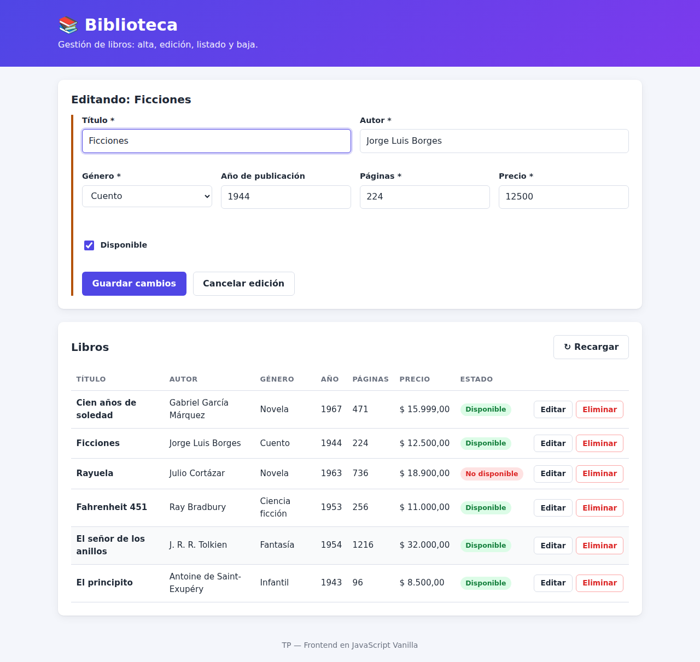
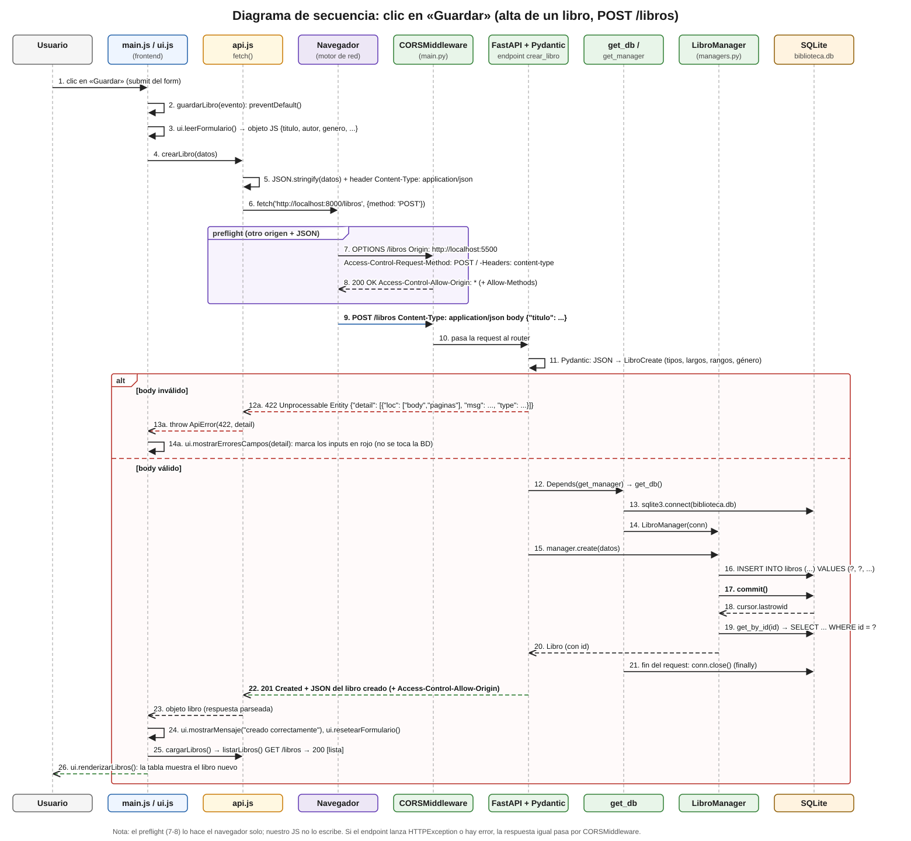
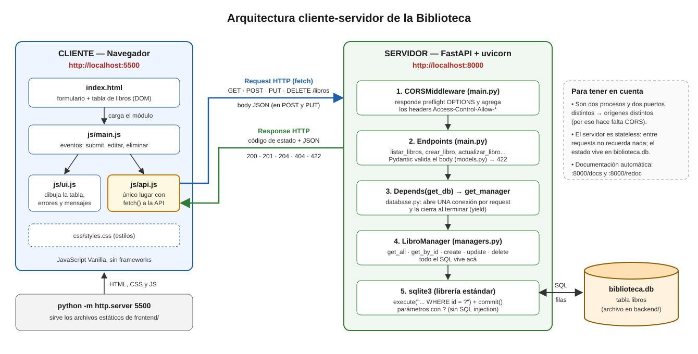
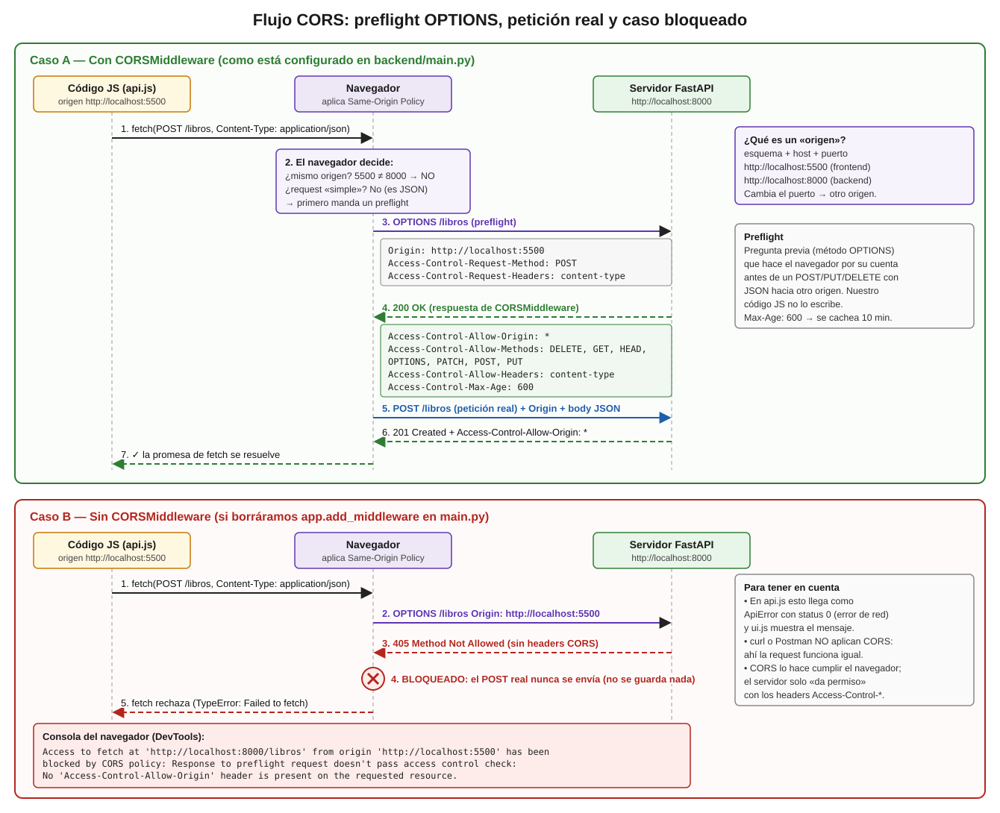

# 📚 Biblioteca de libros — TP Full Stack (FastAPI + SQLite + JavaScript Vanilla)

> **Completar: Nombre Apellido — Curso**
>
> Materia: _Completar_ · Docente: _Completar_ · Fecha de entrega: _Completar_

---

## Índice

1. [Descripción del tema](#1-descripción-del-tema)
2. [Tecnologías usadas](#2-tecnologías-usadas)
3. [Estructura del proyecto](#3-estructura-del-proyecto)
4. [Instalación y ejecución paso a paso](#4-instalación-y-ejecución-paso-a-paso)
5. [Documentación automática de la API (/docs y /redoc)](#5-documentación-automática-de-la-api)
6. [Endpoints con ejemplos](#6-endpoints-con-ejemplos)
7. [Capturas de pantalla](#7-capturas-de-pantalla)
8. [Criterios de diseño](#8-criterios-de-diseño)
9. [Alcance: qué quedó afuera](#9-alcance-qué-quedó-afuera)
10. [Preguntas de arquitectura](#10-preguntas-de-arquitectura)

---

## 1. Descripción del tema

La aplicación administra el catálogo de una **biblioteca de libros**. Desde una página web se puede:

- **Listar** todos los libros (título, autor, género, año, páginas, precio y si está disponible).
- **Crear** un libro nuevo con un formulario.
- **Editar** un libro existente (se carga en el mismo formulario).
- **Eliminar** un libro (con confirmación).

Está separada en dos partes que corren como **dos procesos distintos**:

- **Backend** (`backend/`): una API REST hecha con **FastAPI** que guarda los datos en una base **SQLite** (`backend/biblioteca.db`). Corre en `http://localhost:8000`.
- **Frontend** (`frontend/`): HTML + CSS + **JavaScript Vanilla** (sin frameworks) que consume la API con `fetch`. Se sirve como archivos estáticos en `http://localhost:5500`.

La entidad principal es `Libro`:

| Campo | Tipo | Reglas |
|---|---|---|
| `id` | int | autoincremental, lo genera la base (solo aparece en las respuestas) |
| `titulo` | str | obligatorio, 1 a 200 caracteres, se recortan los espacios |
| `autor` | str | obligatorio, 1 a 120 caracteres |
| `genero` | str | obligatorio, uno de: Novela, Cuento, Poesía, Ensayo, Ciencia ficción, Fantasía, Historia, Biografía, Infantil, Otro |
| `anio_publicacion` | int o `null` | opcional, entre 1000 y el año actual |
| `paginas` | int | obligatorio, entre 1 y 10000 |
| `precio` | float | obligatorio, mayor o igual a 0 |
| `disponible` | bool | opcional, por defecto `true` |

Cuando el backend arranca y la tabla está vacía, se cargan **6 libros de ejemplo** (Cien años de soledad, Ficciones, Rayuela, etc.) para que la pantalla no aparezca vacía la primera vez.

El contrato completo de la API (la "fuente de verdad" que usamos para que backend y frontend coincidan) está en [`docs/CONTRATO_API.md`](docs/CONTRATO_API.md).

---

## 2. Tecnologías usadas

| Capa | Tecnología | Para qué se usa |
|---|---|---|
| Backend | **Python 3.10+** | Lenguaje del servidor |
| Backend | **FastAPI** | Framework para la API REST: rutas, validación, documentación automática |
| Backend | **Uvicorn** | Servidor ASGI que ejecuta la app de FastAPI |
| Backend | **Pydantic v2** | Modelos (`LibroCreate`, `LibroUpdate`, `Libro`) que validan y convierten el JSON |
| Backend | **sqlite3** (librería estándar) | Acceso a la base de datos SQLite, sin ORM |
| Base de datos | **SQLite** | Base de datos en un único archivo: `backend/biblioteca.db` |
| Frontend | **HTML5 + CSS3** | Estructura y estilos de la página |
| Frontend | **JavaScript Vanilla (ES Modules)** | Lógica del cliente, `fetch` a la API y manipulación del DOM |
| Frontend | `python -m http.server` | Servidor de archivos estáticos para el frontend (puerto 5500) |
| Tests | **pytest + httpx** (`TestClient`) | Tests automáticos de la API (`backend/tests/`) |

---

## 3. Estructura del proyecto

```
.
├── README.md                  ← este archivo
├── backend/
│   ├── main.py                ← app FastAPI: CORS, endpoints y dependencia get_manager
│   ├── models.py              ← modelos Pydantic: LibroBase, LibroCreate, LibroUpdate, Libro
│   ├── managers.py            ← clase LibroManager: todo el SQL (get_all, get_by_id, create, update, delete)
│   ├── database.py            ← get_db() (conexión por request), crear_tabla(), datos de ejemplo, init_db()
│   ├── requirements.txt       ← dependencias de Python
│   ├── biblioteca.db          ← se crea solo al arrancar (está en .gitignore)
│   └── tests/
│       ├── conftest.py
│       └── test_api.py        ← tests de la API con una base temporal
├── frontend/
│   ├── index.html             ← formulario + tabla de libros
│   ├── css/
│   │   └── styles.css
│   └── js/
│       ├── api.js             ← ÚNICO archivo que hace fetch() al backend
│       ├── ui.js              ← todo lo que toca el DOM (tabla, mensajes, errores por campo)
│       └── main.js            ← orquesta: eventos (submit, editar, eliminar) y llama a api.js / ui.js
└── docs/
    ├── CONTRATO_API.md        ← contrato acordado de la API
    ├── arquitectura.svg       ← diagrama de arquitectura
    ├── secuencia_post.svg     ← diagrama de secuencia del POST
    ├── flujo_cors.svg         ← diagrama del flujo CORS
    └── capturas/              ← capturas de pantalla de la app funcionando
```

---

## 4. Instalación y ejecución paso a paso

### Requisitos previos

- **Python 3.10 o superior** (`python --version` en Windows, `python3 --version` en Linux/macOS).
- Un navegador moderno (Chrome, Firefox, Edge).
- No hace falta instalar Node ni ninguna base de datos: SQLite viene incluido en Python.

### Paso 1 — Obtener el proyecto

```bash
git clone <URL-del-repositorio> biblioteca
cd biblioteca
```

(O descomprimir el `.zip` y abrir una terminal en la carpeta raíz del proyecto.)

### Paso 2 — Crear y activar un entorno virtual (venv)

**Linux / macOS**

```bash
python3 -m venv venv
source venv/bin/activate
```

**Windows (PowerShell)**

```powershell
python -m venv venv
venv\Scripts\Activate.ps1
```

> Si PowerShell no deja ejecutar el script de activación, correr una vez:
> `Set-ExecutionPolicy -Scope CurrentUser RemoteSigned`.
> En **CMD** (símbolo del sistema) se activa con `venv\Scripts\activate.bat`.

Cuando el venv está activo, el prompt empieza con `(venv)`.

### Paso 3 — Instalar las dependencias

Con el venv activado, desde la raíz del proyecto (igual en Windows y Linux):

```bash
pip install -r backend/requirements.txt
```

### Paso 4 — Levantar el backend (terminal 1)

```bash
cd backend
uvicorn main:app --reload
```

Tiene que aparecer algo como:

```
INFO:     Uvicorn running on http://127.0.0.1:8000 (Press CTRL+C to quit)
INFO:     Application startup complete.
```

- La primera vez se crea `backend/biblioteca.db` con la tabla `libros` y los 6 libros de ejemplo.
- `--reload` reinicia el servidor solo cuando se modifica un `.py` (útil para desarrollo).
- Para comprobar que anda: abrir <http://localhost:8000/libros> en el navegador y debería verse el JSON con la lista.

### Paso 5 — Levantar el frontend (terminal 2)

Abrir **otra** terminal (el backend tiene que seguir corriendo en la primera), activar el venv de nuevo y:

**Linux / macOS**

```bash
cd frontend
python3 -m http.server 5500
```

**Windows**

```powershell
cd frontend
python -m http.server 5500
```

### Paso 6 — Usar la aplicación

Abrir en el navegador: **<http://localhost:5500>**

> ⚠️ No abrir `index.html` con doble clic (`file://...`): los ES Modules (`<script type="module">`) no cargan desde `file://`, por eso se sirve con `http.server`.

### (Opcional) Correr los tests

```bash
cd backend
pytest -v
```

Los tests usan una base temporal (con `app.dependency_overrides[get_db]`), así que no tocan `biblioteca.db`.

### Problemas comunes

| Síntoma | Causa probable | Solución |
|---|---|---|
| La página muestra "No se pudo conectar con la API" | El backend no está corriendo | Levantar `uvicorn main:app --reload` dentro de `backend/` |
| `uvicorn: command not found` / no se reconoce | El venv no está activado | Activar el venv (Paso 2) |
| `Address already in use` | El puerto 8000 o 5500 ya está ocupado | Cerrar el otro proceso o usar otro puerto (si se cambia el 8000, actualizar `API_URL` en `frontend/js/api.js`) |
| Quiero volver a los datos de ejemplo | Se modificó la base | Parar el backend, borrar `backend/biblioteca.db` y volver a levantarlo |

---

## 5. Documentación automática de la API

FastAPI genera la documentación sola a partir del código (rutas, modelos Pydantic, `summary`, `tags` y ejemplos):

- **Swagger UI**: <http://localhost:8000/docs> → permite probar cada endpoint desde el navegador con el botón _"Try it out"_.
- **ReDoc**: <http://localhost:8000/redoc> → la misma información, en formato de lectura.
- **Esquema OpenAPI (JSON)**: <http://localhost:8000/openapi.json>.

Además, `GET /` responde `{"mensaje": "API Biblioteca funcionando", "docs": "/docs"}` para comprobar rápido que la API está viva.

---

## 6. Endpoints con ejemplos

URL base: `http://localhost:8000`. Todas las respuestas (menos el 204) son JSON.

| Método | Ruta | Descripción | Éxito | Errores |
|---|---|---|---|---|
| GET | `/libros` | Lista todos los libros | 200 | — |
| GET | `/libros/{id}` | Trae un libro | 200 | 404 |
| POST | `/libros` | Crea un libro | 201 | 422 |
| PUT | `/libros/{id}` | Actualiza un libro (parcial) | 200 | 404, 422 |
| DELETE | `/libros/{id}` | Elimina un libro | 204 (sin body) | 404 |

> Los ejemplos de abajo son respuestas reales del backend, copiadas de la terminal.
> En Windows PowerShell conviene usar `curl.exe` (porque `curl` es un alias de otro comando) y las comillas del JSON cambian; lo más cómodo en Windows es probar desde `/docs`.

### GET `/libros` — listar

```bash
curl http://localhost:8000/libros
```

**200 OK**

```json
[
  {
    "titulo": "Cien años de soledad",
    "autor": "Gabriel García Márquez",
    "genero": "Novela",
    "anio_publicacion": 1967,
    "paginas": 471,
    "precio": 15999.0,
    "disponible": true,
    "id": 1
  },
  {
    "titulo": "Ficciones",
    "autor": "Jorge Luis Borges",
    "genero": "Cuento",
    "anio_publicacion": 1944,
    "paginas": 224,
    "precio": 12500.0,
    "disponible": true,
    "id": 2
  }
]
```

(recortado: trae los 6 libros de ejemplo más los que se agreguen)

### GET `/libros/{id}` — obtener uno

```bash
curl http://localhost:8000/libros/1
```

**200 OK**

```json
{"titulo": "Cien años de soledad", "autor": "Gabriel García Márquez", "genero": "Novela", "anio_publicacion": 1967, "paginas": 471, "precio": 15999.0, "disponible": true, "id": 1}
```

Si el id no existe:

```bash
curl -i http://localhost:8000/libros/999
```

**404 Not Found**

```json
{"detail": "Libro no encontrado"}
```

### POST `/libros` — crear

```bash
curl -i -X POST http://localhost:8000/libros \
  -H "Content-Type: application/json" \
  -d '{"titulo": "El Aleph", "autor": "Jorge Luis Borges", "genero": "Cuento", "anio_publicacion": 1949, "paginas": 208, "precio": 13500, "disponible": true}'
```

**201 Created**

```json
{"titulo": "El Aleph", "autor": "Jorge Luis Borges", "genero": "Cuento", "anio_publicacion": 1949, "paginas": 208, "precio": 13500.0, "disponible": true, "id": 7}
```

Fijarse que mandamos `"precio": 13500` (entero) y vuelve `13500.0`: Pydantic lo convirtió a `float` porque así está declarado en el modelo.

Si el body no cumple las reglas → **422 Unprocessable Entity** (ejemplo completo en la [pregunta 6](#p6-json-como-formato-de-intercambio-y-validación-con-pydantic)).

### PUT `/libros/{id}` — actualizar (parcial)

Solo se mandan los campos que cambian (el modelo `LibroUpdate` tiene todo opcional):

```bash
curl -X PUT http://localhost:8000/libros/3 \
  -H "Content-Type: application/json" \
  -d '{"precio": 9999, "disponible": true}'
```

**200 OK** (devuelve el libro completo ya actualizado)

```json
{"titulo": "Rayuela", "autor": "Julio Cortázar", "genero": "Novela", "anio_publicacion": 1963, "paginas": 736, "precio": 9999.0, "disponible": true, "id": 3}
```

Errores posibles:

- `404 {"detail": "Libro no encontrado"}` si el id no existe.
- `422` si un campo es inválido, o si se manda un campo obligatorio como `null` (se puede **omitir**, pero no **borrar**):

```json
{"detail": [{"type": "value_error", "loc": ["body", "titulo"], "msg": "Value error, Este campo no puede ser null", "input": null, "ctx": {"error": {}}}]}
```

### DELETE `/libros/{id}` — eliminar

```bash
curl -i -X DELETE http://localhost:8000/libros/7
```

**204 No Content** (sin body)

```
HTTP/1.1 204 No Content
```

Si se vuelve a borrar el mismo id: **404** `{"detail": "Libro no encontrado"}`.

---

## 7. Capturas de pantalla

### Listado de libros


Pantalla principal: formulario arriba y tabla con los libros que vienen de `GET /libros`. El estado se muestra con una etiqueta "Disponible" / "No disponible".

### Formulario con errores de validación (422)


Se envió el formulario con datos inválidos. El backend respondió **422** y `ui.mostrarErroresCampos()` leyó cada error de `detail`, usó el último elemento de `loc` (por ejemplo `"paginas"`) para saber a qué input corresponde, y lo marcó en rojo con su mensaje.

### Edición de un libro



Al tocar "Editar" en una fila, `ui.cargarLibroEnFormulario()` carga los datos, el botón pasa a decir "Guardar cambios" y aparece "Cancelar edición". Al guardar se hace un `PUT /libros/{id}`.

### Error de red (backend apagado)


Con el backend apagado, `fetch` falla, `api.js` lo convierte en un `ApiError` con `status 0` y se muestra el mensaje "No se pudo conectar con la API...". La página no se rompe.

> Extra: también hay una captura en ancho de celular en `docs/capturas/movil.png`.

---

## 8. Criterios de diseño

Decisiones que tomamos y por qué:

| Decisión | Por qué |
|---|---|
| **Separar `main.py` / `managers.py` / `database.py` / `models.py`** | Cada archivo tiene una sola responsabilidad: HTTP (main), SQL (managers), conexión (database), forma de los datos (models). Si mañana cambia la base, se toca `managers.py` y nada más. |
| **`LibroManager` con todo el SQL** | Los endpoints no tienen ni una línea de SQL; solo llaman `manager.create(datos)`, `manager.get_by_id(id)`, etc. Es más fácil de leer y de testear. |
| **Una conexión por request con `Depends(get_db)`** | `get_db()` abre la conexión, la entrega con `yield` y la cierra en el `finally`, aunque haya error. No queda ninguna conexión abierta "colgada" ni compartida entre requests. |
| **SQL parametrizado (`?`)** | Los valores nunca se concatenan al SQL, así se evita SQL injection. En `update()` los nombres de columna salen del modelo Pydantic (no del usuario). |
| **Tres modelos Pydantic: `LibroCreate`, `LibroUpdate`, `Libro`** | Crear exige los campos obligatorios; actualizar permite mandar solo algunos (parcial); la respuesta incluye el `id`. Las reglas (largos, rangos) están definidas una sola vez con tipos `Annotated` reutilizables. |
| **`PUT` parcial con `model_dump(exclude_unset=True)`** | Así distinguimos "no lo mandó" (no se toca) de "lo mandó". Además, un campo obligatorio no se puede mandar como `null` (validador `no_permitir_null`). |
| **Validación en el backend, no en el navegador** | El form tiene `novalidate`: la fuente de verdad es Pydantic. Cualquier cliente (curl, Postman, otra app) pasa por las mismas reglas. El frontend muestra los errores 422 campo por campo. |
| **Códigos HTTP correctos (201, 204, 404, 422)** | El frontend decide qué hacer mirando el código, no adivinando el contenido. |
| **Frontend en 3 archivos JS** | `api.js` es el único que hace `fetch`; `ui.js` es el único que toca el DOM; `main.js` une los dos. Si cambia la URL de la API se toca un solo lugar (`API_URL`). |
| **Clase `ApiError` en `api.js`** | Unifica todos los errores (red = status 0, 404, 422, 500) en un solo tipo, con `esValidacion` y `esDeRed`, para que `main.js` los maneje en un solo lugar (`manejarError`). |
| **Recargar la lista después de guardar o borrar** | Después de crear/editar/eliminar se llama a `cargarLibros()` de nuevo, así la tabla siempre muestra lo que hay realmente en la base. |
| **Evitar doble envío** | Mientras se guarda, el botón se deshabilita y muestra "Guardando…" (`ui.setGuardando(true)`). |
| **Datos de ejemplo al iniciar** | `init_db()` corre en el `lifespan` de FastAPI: crea la tabla y, si está vacía, inserta 6 libros. Así la app se puede probar enseguida. |
| **CORS con `allow_origins=["*"]`** | Es un TP que corre en local, así que lo dejamos abierto para que funcione desde cualquier puerto. En producción pondríamos solo el origen real del frontend (por ejemplo `["http://localhost:5500"]`). |
| **SQLite sin ORM** | Para el TP alcanza un archivo y la librería estándar `sqlite3`; así se ve el SQL explícito, que es parte de lo que queremos aprender. |

---

## 9. Alcance: qué quedó afuera

- **Filtros por query string** (por ejemplo `GET /libros?genero=Novela` o `?disponible=true`): **no se implementaron**, por alcance acordado. `GET /libros` siempre devuelve todos los libros. Quedaría como mejora futura agregar parámetros opcionales al endpoint `listar_libros` y un `WHERE` en `LibroManager.get_all()`.
- Paginación, autenticación de usuarios y búsqueda por texto tampoco forman parte de este TP.

---

## 10. Preguntas de arquitectura

### P1. Ciclo de vida de una petición: desde el clic en "Guardar" hasta SQLite y la pantalla



Voy a contar qué pasa cuando cargo un libro nuevo y aprieto el botón de guardar (en pantalla dice "Crear libro"; es el botón `#btn-guardar` del formulario):

1. **El clic dispara el `submit` del formulario.** En `main.js` está registrado `form.addEventListener("submit", guardarLibro)`. Lo primero que hace `guardarLibro` es `evento.preventDefault()`, para que el navegador no recargue la página (que es lo que hace un form por defecto).
2. **Leer el formulario.** `ui.leerFormulario()` arma un objeto JS con los valores del form, convirtiendo los números con `aNumero()` (vacío → `null`) y el checkbox a `true/false`. Como no hay id en edición (`ui.obtenerIdEnEdicion()` devuelve `null`), sabemos que es un alta.
3. **Bloquear el botón.** `ui.setGuardando(true)` lo deshabilita y le pone "Guardando…" para que no se mande dos veces.
4. **Llamar a la API.** `main.js` llama a `crearLibro(datos)` de `api.js`, que llama a `request("/libros", {method: "POST", body: datos})`. Ahí se hace `JSON.stringify(datos)`, se agrega el header `Content-Type: application/json` y se ejecuta `fetch("http://localhost:8000/libros", ...)`.
5. **Preflight CORS (lo hace el navegador solo).** Como la página está en el puerto 5500 y la API en el 8000, son orígenes distintos, y como mandamos JSON no es una request "simple". Entonces el navegador manda primero un `OPTIONS /libros` con `Origin` y `Access-Control-Request-Method: POST`. El `CORSMiddleware` de `main.py` contesta 200 con `Access-Control-Allow-Origin: *`, y recién ahí el navegador manda el `POST` de verdad (está explicado en la P4).
6. **Llega al servidor.** Uvicorn recibe la request, pasa por el `CORSMiddleware` y FastAPI la enruta a la función `crear_libro(datos: LibroCreate, manager = Depends(get_manager))`.
7. **Validación con Pydantic.** Antes de ejecutar el endpoint, FastAPI parsea el JSON del body y arma un `LibroCreate`. Si algo no cumple (título vacío, género que no está en la lista, páginas = 0…) **ni siquiera se entra a la función**: FastAPI responde **422** con la lista de errores. En ese caso `api.js` lanza un `ApiError` con `status 422`, `main.js` lo atrapa en el `catch` y `ui.mostrarErroresCampos()` pinta cada input en rojo. La base no se toca.
8. **Inyección de dependencias.** Si el body es válido, FastAPI resuelve `Depends(get_manager)`, que a su vez necesita `Depends(get_db)`. `get_db()` abre `sqlite3.connect(biblioteca.db)` y hace `yield conn`; `get_manager` crea `LibroManager(conn)`.
9. **Persistir.** El endpoint hace `return manager.create(datos)`. `LibroManager.create` ejecuta `INSERT INTO libros (...) VALUES (?, ?, ?, ?, ?, ?, ?)`, hace `commit()` (acá queda guardado en el archivo), toma `cursor.lastrowid` y llama a `get_by_id()` para devolver el libro como quedó en la base, con su `id`.
10. **Responder.** FastAPI convierte el `Libro` a JSON (validándolo con `response_model=Libro`) y responde **201 Created**. Al terminar la request, el `finally` de `get_db()` cierra la conexión. El `CORSMiddleware` agrega `Access-Control-Allow-Origin` a la respuesta para que el navegador deje que nuestro JS la lea.
11. **Actualizar la pantalla.** En `api.js` el `fetch` se resuelve, se parsea el JSON y se devuelve el libro. `main.js` muestra "Libro «…» creado correctamente." con `ui.mostrarMensaje`, limpia el form con `ui.resetearFormulario()` y llama a `cargarLibros()`, que hace un `GET /libros` y redibuja la tabla con `ui.renderizarLibros()`. En el `finally`, `ui.setGuardando(false)` vuelve a habilitar el botón.

Resumido: **evento → JS arma JSON → fetch → (preflight) → middleware → validación → dependencia → manager → SQL + commit → 201 JSON → JS actualiza el DOM**.

---

### P2. ¿Quién es el cliente y quién el servidor? ¿En qué se diferencia de una app de escritorio?



- **El cliente es el navegador** ejecutando nuestro frontend (`index.html` + `api.js`, `ui.js`, `main.js`). Es el que *pide* cosas: inicia todas las requests HTTP y se encarga de mostrar los datos y de la interacción con el usuario. Está en `http://localhost:5500`.
- **El servidor es la app FastAPI** que corre con Uvicorn en `http://localhost:8000`. *Espera* requests, aplica las reglas (validación con Pydantic), habla con la base de datos a través de `LibroManager` y responde con JSON. Nunca toma la iniciativa de mandarle algo al cliente.
- **La base de datos** (`biblioteca.db`) solo la toca el servidor. El navegador no tiene ni idea de que existe SQLite; solo conoce las URLs `/libros`.

Un detalle que al principio confunde: también hay un "servidor" en el puerto 5500 (`python -m http.server`), pero ese solo **entrega los archivos** HTML/CSS/JS una vez. Después, todo lo que es lógica de la app lo hace el JS en el navegador hablando con la API del 8000.

**Diferencia con una app de escritorio tradicional:** en una app de escritorio (por ejemplo un programa en Python con Tkinter que abre `biblioteca.db` directamente), la interfaz, la lógica y el acceso a datos están **en el mismo programa y en la misma máquina**; un botón llama a una función que hace el `INSERT` directo, sin red de por medio. En nuestra app eso está **separado en dos procesos que se comunican por HTTP con JSON**. Eso tiene consecuencias:

- Cualquier cliente que hable HTTP puede usar la API: nuestro frontend, `curl`, Swagger en `/docs` o, en el futuro, una app de celular.
- Las reglas están en un solo lugar (el servidor), no repetidas en cada programa instalado.
- Para actualizar la app no hay que reinstalar nada en cada PC: se cambia el servidor o los archivos del frontend.
- A cambio aparecen cosas que en escritorio no existen: la red puede fallar (por eso `api.js` maneja el error de red con `status 0`), hay latencia, y el navegador aplica reglas de seguridad como CORS.

---

### P3. Métodos HTTP y códigos de estado

Cada operación del CRUD usa el método HTTP que le corresponde por su significado:

- **GET**: leer, no modifica nada (se puede repetir sin efectos).
- **POST**: crear un recurso nuevo dentro de la colección `/libros`.
- **PUT**: modificar el recurso `/libros/{id}` (en nuestro caso es una actualización parcial: solo los campos enviados).
- **DELETE**: borrar el recurso `/libros/{id}`.

Y los códigos de estado le dicen al cliente qué pasó sin tener que leer el body:

- **200 OK**: salió bien y devuelvo datos (listar, obtener, actualizar).
- **201 Created**: salió bien y **se creó** algo nuevo. Lo forzamos con `status_code=status.HTTP_201_CREATED` en el decorador de `crear_libro`; si no, FastAPI devolvería 200.
- **204 No Content**: salió bien pero no hay nada para devolver (el libro ya no existe). Por eso en `api.js` hay un `if (respuesta.status === 204) return null;`, porque no hay JSON para parsear.
- **404 Not Found**: el id no existe. Lo generamos nosotros con `raise HTTPException(status_code=404, detail="Libro no encontrado")` cuando el manager devuelve `None` (o `False` en `delete`).
- **422 Unprocessable Entity**: el JSON llegó, pero los datos no cumplen las reglas del modelo Pydantic. Este no lo escribimos nosotros: lo genera FastAPI automáticamente.

| Operación | Método | Ruta | Código éxito | Código error |
|---|---|---|---|---|
| Listar libros | GET | `/libros` | 200 OK (lista JSON) | — |
| Obtener un libro | GET | `/libros/{id}` | 200 OK (libro JSON) | 404 (no existe), 422 (id no numérico, ej. `/libros/abc`) |
| Crear libro | POST | `/libros` | 201 Created (libro creado, con `id`) | 422 (datos inválidos) |
| Actualizar libro (parcial) | PUT | `/libros/{id}` | 200 OK (libro actualizado) | 404 (no existe), 422 (datos inválidos) |
| Eliminar libro | DELETE | `/libros/{id}` | 204 No Content (sin body) | 404 (no existe) |

---

### P4. CORS: Same-Origin Policy, por qué bloquea el navegador y qué hace el middleware



**Same-Origin Policy (SOP)** es una regla de seguridad de los navegadores: el JavaScript de una página solo puede leer respuestas de **su mismo origen**. El origen es la combinación **esquema + host + puerto**. En nuestro proyecto:

- la página viene de `http://localhost:5500`
- la API está en `http://localhost:8000`

El host es el mismo, pero **el puerto cambia, así que son orígenes distintos**. Sin nada más, el navegador no dejaría que `api.js` lea las respuestas de la API.

**¿Por qué bloquea?** Para protegernos: si no existiera esta regla, cualquier página que visitemos podría usar JavaScript para hacer requests a otro sitio (por ejemplo, el home banking donde tenemos la sesión abierta) y leer la respuesta. El navegador no sabe si a la API "le parece bien" que otra página la use, así que por defecto **no deja**.

**CORS** (Cross-Origin Resource Sharing) es la forma en la que el **servidor** le dice al navegador "a este origen sí lo dejo". Funciona con headers:

1. Como nuestro `POST`/`PUT` mandan `Content-Type: application/json` (y `DELETE` no es un método "simple"), el navegador primero hace un **preflight**: un `OPTIONS /libros` con `Origin: http://localhost:5500`, `Access-Control-Request-Method: POST` y `Access-Control-Request-Headers: content-type`.
2. El `CORSMiddleware` que agregamos en `main.py` con `app.add_middleware(CORSMiddleware, allow_origins=["*"], allow_methods=["*"], allow_headers=["*"])` contesta ese `OPTIONS` él mismo (no llega a ningún endpoint) con `200 OK` y los headers `Access-Control-Allow-Origin: *`, `Access-Control-Allow-Methods: DELETE, GET, HEAD, OPTIONS, PATCH, POST, PUT`, `Access-Control-Allow-Headers: content-type` y `Access-Control-Max-Age: 600` (el navegador recuerda el permiso 10 minutos). Esto lo comprobamos con curl, son los headers reales.
3. Con ese permiso, el navegador manda la **petición real** (`POST`), y el middleware también le agrega `Access-Control-Allow-Origin: *` a esa respuesta, así nuestro JS la puede leer.

**¿Y si sacamos el middleware?** Probamos borrarlo: el `OPTIONS /libros` devuelve `405 Method Not Allowed` sin headers CORS, el navegador **cancela** y el `POST` nunca se envía. En la consola aparece "has been blocked by CORS policy" y `fetch` falla con `TypeError: Failed to fetch`, que en nuestro `api.js` termina siendo un `ApiError` con `status 0`.

Algo importante que aprendimos: **CORS lo hace cumplir el navegador, no el servidor**. Con `curl` o desde Swagger (`/docs`, que está en el mismo origen 8000) todo funciona aunque no haya middleware. Y el `"*"` lo usamos porque es un TP local; en producción convendría poner solo el origen real del frontend.

---

### P5. Separación de responsabilidades e inyección de dependencias

**¿Por qué un `LibroManager` separado de los endpoints?**

En `main.py` los endpoints solo se ocupan de **HTTP**: qué ruta, qué método, qué modelo de entrada, qué código devolver y cuándo tirar un 404. Por ejemplo `obtener_libro` es básicamente `manager.get_by_id(libro_id)` y, si da `None`, `HTTPException(404)`. Todo el **SQL** está en `managers.py`, dentro de `LibroManager` (`get_all`, `get_by_id`, `create`, `update`, `delete`).

Beneficios concretos que vimos:

- **Se lee más fácil**: cada endpoint ocupa pocas líneas y se entiende de un vistazo.
- **Se reutiliza**: `create()` y `update()` usan `get_by_id()` para devolver el libro guardado; `update()` lo usa además para saber si existe. No hay SQL repetido.
- **Cambiar la base no rompe la API**: si pasáramos a PostgreSQL o a un ORM, se reescribe `LibroManager` y `main.py` queda igual, porque solo conoce sus métodos.
- **Cada capa tiene su propio "idioma"**: el manager no sabe nada de HTTP (devuelve `None`/`False`, no 404) y los endpoints no saben nada de SQL.

**¿Qué ganamos con la inyección de dependencias (`Depends`)?**

Los endpoints no crean la conexión ni el manager; los **reciben** como parámetro: `manager: LibroManager = Depends(get_manager)`, y `get_manager` a su vez recibe `db = Depends(get_db)`. FastAPI se encarga de llamarlas en orden.

- **Ciclo de vida asegurado**: `get_db()` usa `yield`, entonces FastAPI ejecuta el `finally: conn.close()` cuando termina la request, **aunque haya habido un error o un 404**. No tenemos que acordarnos de cerrar la conexión en cada endpoint.
- **Una conexión por request**: cada request tiene la suya, no se comparten entre requests distintas.
- **Testing**: en `backend/tests/test_api.py` reemplazamos la base real por una temporal con `app.dependency_overrides[get_db] = get_db_test`. Sin tocar ni una línea de los endpoints, los tests corren contra otra base y no ensucian `biblioteca.db`. Esto sería mucho más difícil si cada endpoint hiciera `sqlite3.connect(...)` adentro.
- **Sin repetir código**: la lógica de "abrir conexión + crear manager" está escrita una sola vez.

**¿Qué pasaría si abriéramos una conexión por cada línea (cada consulta)?**

- **Sería lento**: abrir una conexión a SQLite implica abrir el archivo, leer el esquema, etc. Hacerlo en cada `execute` multiplica ese costo.
- **Se rompe la lógica de transacciones**: en `LibroManager.create` el `INSERT`, el `commit()`, el `cursor.lastrowid` y el `get_by_id()` usan **la misma** conexión. Si el `INSERT` fuera por una conexión y el `commit()` por otra, el commit no confirmaría nada (cada conexión tiene su propia transacción) y el libro se perdería. Y `lastrowid` solo tiene sentido en la conexión que hizo el insert.
- **Más bloqueos**: SQLite bloquea el archivo para escribir. Con muchas conexiones abiertas a la vez es más fácil chocarse con `database is locked`.
- **Fugas**: es muy fácil olvidarse de cerrar alguna, y quedan conexiones abiertas consumiendo recursos.

---

### P6. JSON como formato de intercambio y validación con Pydantic

**¿Por qué JSON?** Porque es texto plano que entienden los dos lados sin librerías extra: en el navegador `JSON.stringify()` / `JSON.parse()` (o `respuesta.json()`), y en Python FastAPI lo convierte solo. Es liviano, legible (se puede leer en la pestaña Network o en curl) y se mapea directo a las estructuras de los dos lenguajes: un objeto JS ↔ un `dict` / modelo en Python, un array ↔ una `list`, `true/false` ↔ `True/False`, `null` ↔ `None`. Lo indicamos con el header `Content-Type: application/json`.

**¿Cómo Pydantic convierte el body?** En `crear_libro(datos: LibroCreate, ...)`, como `LibroCreate` es un `BaseModel`, FastAPI sabe que tiene que leer el **body**. Entonces:

1. Lee los bytes del body y los parsea como JSON (si el JSON está mal escrito ya da 422 `json_invalid`).
2. Arma un `LibroCreate` campo por campo, **convirtiendo tipos** cuando tiene sentido: `"paginas": "736"` (string) se convierte a `736` (int), `"precio": 13500` pasa a `13500.0` (float), y como el modelo tiene `str_strip_whitespace=True`, `"  Rayuela  "` queda `"Rayuela"`.
3. **Valida** las reglas que definimos en `models.py`: `min_length`/`max_length` en título y autor, `ge`/`le` en páginas y precio, el `Literal` de géneros, y el validador propio `validar_anio` (no puede ser mayor al año actual).
4. Completa los valores por defecto (`disponible = True`, `anio_publicacion = None`).
5. Junta **todos** los errores (no solo el primero) y, si hay alguno, responde 422 sin ejecutar el endpoint.

**¿Qué garantiza?** Que cuando el código de `crear_libro` y `LibroManager.create` se ejecuta, `datos` es un objeto con **los tipos correctos y las reglas cumplidas**. No hace falta escribir ni un `if` de validación en el endpoint, y a la base nunca llega un libro con páginas negativas o un género inventado. También la salida se valida con `response_model=Libro`, así que la respuesta siempre tiene la forma del contrato.

**Ejemplo real de request inválido** (lo corrimos contra el backend):

```bash
curl -i -X POST http://localhost:8000/libros \
  -H "Content-Type: application/json" \
  -d '{"titulo": "", "autor": "Anónimo", "genero": "Terror", "paginas": "muchas", "precio": -5}'
```

Respuesta: **`HTTP/1.1 422 Unprocessable Entity`**

```json
{
  "detail": [
    {
      "type": "string_too_short",
      "loc": ["body", "titulo"],
      "msg": "String should have at least 1 character",
      "input": "",
      "ctx": {"min_length": 1}
    },
    {
      "type": "literal_error",
      "loc": ["body", "genero"],
      "msg": "Input should be 'Novela', 'Cuento', 'Poesía', 'Ensayo', 'Ciencia ficción', 'Fantasía', 'Historia', 'Biografía', 'Infantil' or 'Otro'",
      "input": "Terror",
      "ctx": {"expected": "'Novela', 'Cuento', 'Poesía', 'Ensayo', 'Ciencia ficción', 'Fantasía', 'Historia', 'Biografía', 'Infantil' or 'Otro'"}
    },
    {
      "type": "int_parsing",
      "loc": ["body", "paginas"],
      "msg": "Input should be a valid integer, unable to parse string as an integer",
      "input": "muchas"
    },
    {
      "type": "greater_than_equal",
      "loc": ["body", "precio"],
      "msg": "Input should be greater than or equal to 0",
      "input": -5,
      "ctx": {"ge": 0.0}
    }
  ]
}
```

Cómo se lee: cada error dice **dónde** (`loc`: en el body, campo `titulo`), **qué** (`msg`), **de qué tipo** (`type`) y **qué valor llegó** (`input`). Se ve que Pydantic devuelve los 4 errores juntos. Si el año fuera `3000`, aparece el error de nuestro validador: `"msg": "Value error, El año de publicación no puede ser mayor a 2026"`.

El frontend aprovecha esa estructura: `ui.mostrarErroresCampos()` toma el último elemento de `loc` (`"titulo"`, `"paginas"`…) para encontrar el input y le pone el mensaje abajo (le saca el prefijo `"Value error, "` con `limpiarMensajePydantic`). Es lo que se ve en la captura `docs/capturas/formulario_errores.png`.

---

### P7. Statelessness (servidor sin estado)

**Qué significa:** el servidor **no guarda nada en memoria entre una request y otra** sobre el cliente. Cada request trae toda la información necesaria para atenderla: el método, la URL con el id (`/libros/3`) y, si hace falta, el body JSON. No hay sesiones, ni cookies, ni variables globales del tipo "último libro que editó este usuario".

En nuestro proyecto se ve en que:

- Cada request crea su propia conexión y su propio `LibroManager` (con `Depends(get_db)` y `get_manager`) y al terminar todo se descarta. No queda nada del request anterior.
- Incluso el "modo edición" del frontend es estado **del cliente**: el id del libro que se está editando vive en el input oculto `#libro-id` del formulario, no en el servidor. Cuando se guarda, el id viaja en la URL del `PUT /libros/{id}`.

**¿Dónde queda el estado?** El único estado persistente es la **base de datos SQLite** (`backend/biblioteca.db`). Si reiniciamos Uvicorn, no se pierde nada, porque todo lo importante ya se guardó con `commit()`. El servidor es solo "lógica" que lee y escribe en la base.

**Ventaja si tuviéramos 3 servidores:** como ninguno guarda nada propio, se podrían poner 3 instancias de la API detrás de un balanceador de carga y **cualquier request podría ir a cualquiera**: el `POST` lo atiende el servidor 1, el `GET` siguiente el servidor 3, y da igual, porque los dos leen la misma base. Si uno se cae, los otros siguen atendiendo y no se pierde ninguna "sesión". Escalar sería simplemente agregar más instancias.

**La limitación de SQLite:** para que eso funcione, los 3 servidores tienen que compartir **la misma base**. SQLite es **un archivo local** (`biblioteca.db`) en el disco de una máquina, sin un proceso servidor al que conectarse por red. Si cada servidor está en otra máquina, cada uno tendría **su propia copia** del archivo y los datos se desincronizarían (un libro creado en el servidor 1 no aparecería en el 2). Compartir el archivo por una carpeta de red tampoco es buena idea, porque el bloqueo de archivos de SQLite no funciona bien así y además solo permite un escritor a la vez. Para escalar de verdad habría que cambiar a una base cliente-servidor como **PostgreSQL** o **MySQL**. Gracias a que todo el SQL está en `LibroManager`, ese cambio quedaría concentrado en `managers.py` y `database.py`, sin tocar los endpoints ni el frontend.
