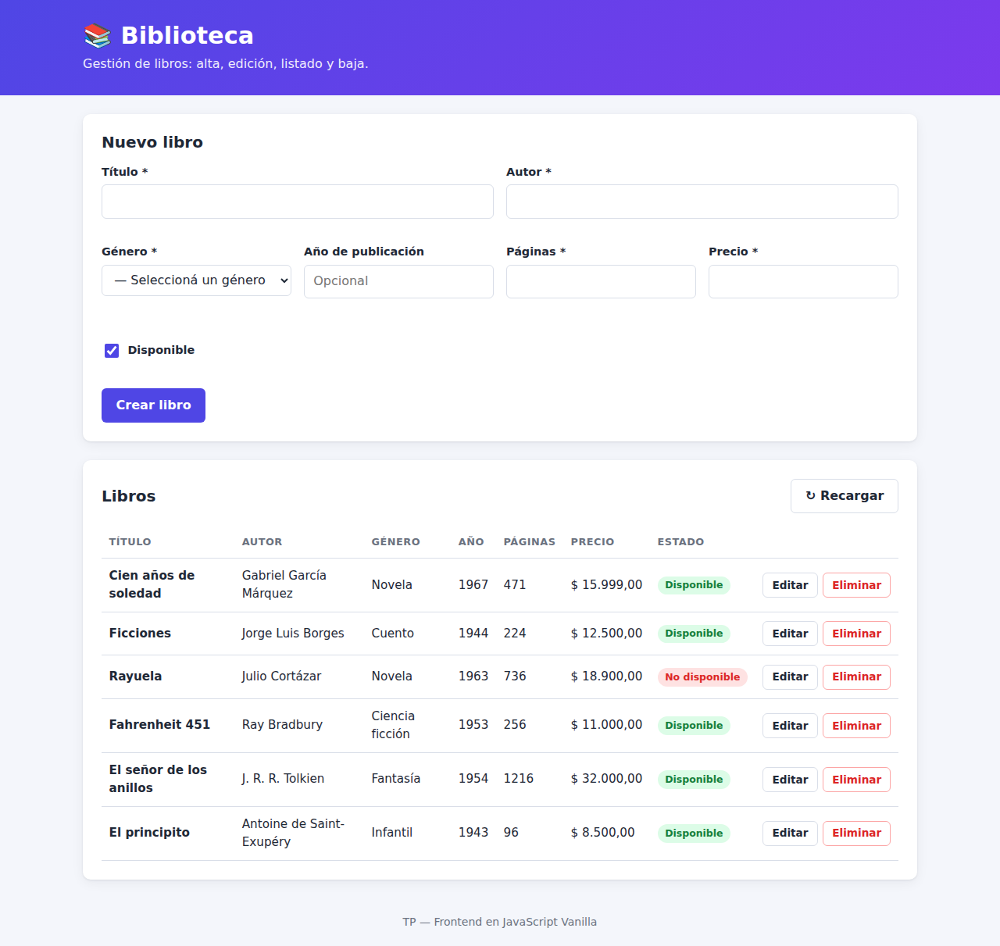
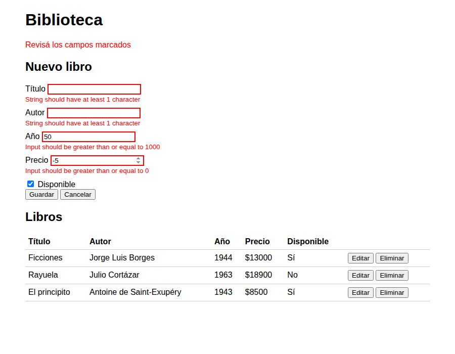
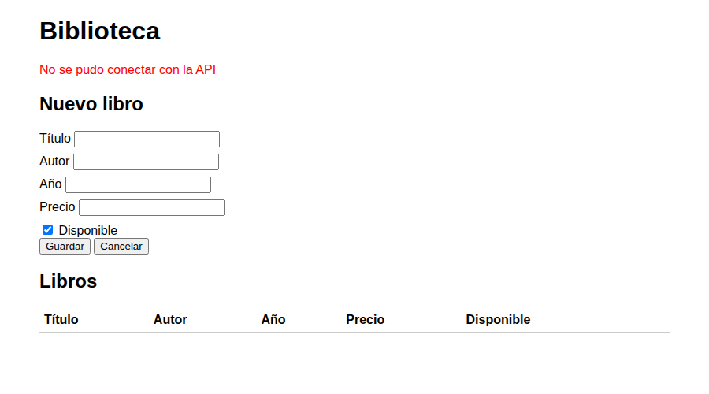
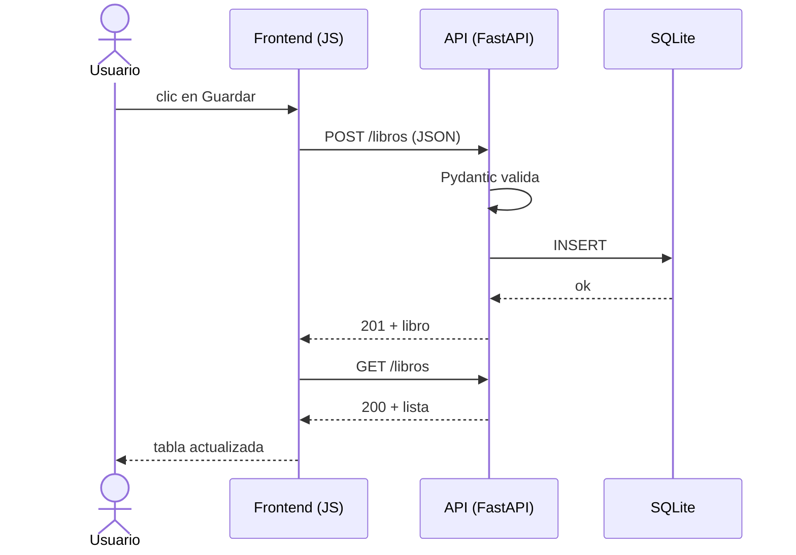
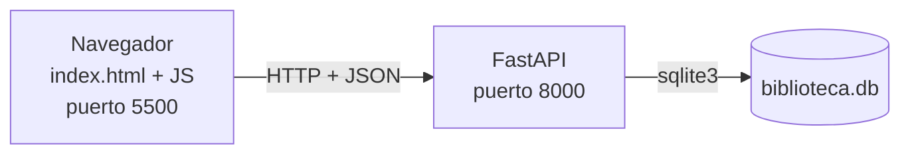
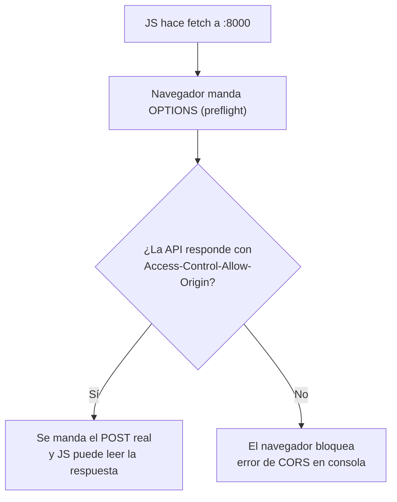

# Biblioteca — TP Full Stack

**Alumno:** Francesco Giacosa — **Curso:** 6to 5ta — **Materia:** Programación

## Tema

Una app para cargar libros. Cada libro tiene: `id`, `titulo`, `autor`, `anio`, `precio` y `disponible`.

## Tecnologías

- **Backend:** Python, FastAPI, Pydantic y SQLite (`sqlite3`).
- **Frontend:** HTML, CSS y JavaScript sin librerías (`fetch` + DOM).

## Cómo ejecutarlo

```bash
# 1. Backend
cd backend
python -m venv venv
source venv/bin/activate        # en Windows: venv\Scripts\activate
pip install -r requirements.txt
uvicorn main:app --reload       # queda en http://localhost:8000

# 2. Frontend (en otra terminal)
cd frontend
python -m http.server 5500      # abrir http://localhost:5500
```

La documentación automática de la API está en **http://localhost:8000/docs**.

## Endpoints

| Método | Ruta | Qué hace | Éxito | Error |
|---|---|---|---|---|
| GET | `/libros` | Lista todos | 200 | — |
| GET | `/libros/{id}` | Trae uno | 200 | 404 |
| POST | `/libros` | Crea uno | 201 | 422 |
| PUT | `/libros/{id}` | Modifica uno | 200 | 404 / 422 |
| DELETE | `/libros/{id}` | Borra uno | 200 | 404 |

Ejemplo de POST:

```
POST /libros
{"titulo": "Ficciones", "autor": "Jorge Luis Borges", "anio": 1944, "precio": 12500}

→ 201
{"titulo": "Ficciones", "autor": "Jorge Luis Borges", "anio": 1944, "precio": 12500.0, "disponible": true, "id": 1}
```

Ejemplo de GET de un id que no existe:

```
GET /libros/9   → 404  {"detail": "Libro no encontrado"}
```

## Capturas

| Listado | Errores de validación | API apagada |
|---|---|---|
|  |  |  |

## Decisiones de diseño

- **Backend en 4 archivos:** `main.py` (rutas), `models.py` (Pydantic), `managers.py` (SQL) y `database.py` (conexión). Así cada archivo tiene una sola tarea.
- **Frontend en 3 archivos JS:** `api.js` es el único que usa `fetch`, `ui.js` solo toca el HTML y `main.js` maneja los eventos.
- **Validación en el backend:** el formulario tiene `novalidate` para que los errores los marque la API (422) y se vean debajo de cada campo.
- **Sin filtros por query string:** quedaron fuera del alcance.

---

## Preguntas de arquitectura

### 1. Ciclo de vida de una petición

Cuando aprieto **Guardar**:

1. `main.js` lee el formulario con `leerFormulario()`.
2. Llama a `crearLibro()` de `api.js`, que hace un `fetch` POST con el libro en JSON.
3. FastAPI recibe el pedido y Pydantic lo valida con `LibroCreate`. Si algo está mal, devuelve 422.
4. Si está bien, `Depends(get_db)` abre la conexión y `LibroManager.create()` hace el `INSERT` en SQLite.
5. La API responde 201 con el libro creado.
6. El frontend muestra "Libro guardado" y vuelve a pedir la lista para redibujar la tabla.



### 2. Cliente y servidor

El **cliente** es el navegador con la página (`frontend/`). El **servidor** es la API de FastAPI (`backend/`), que es la única que toca la base de datos. En una app de escritorio todo corre junto en la misma computadora. Acá están separados y se hablan por HTTP, así que el mismo servidor puede atender a muchos clientes.



### 3. HTTP

Los **métodos** dicen qué quiero hacer: GET leer, POST crear, PUT modificar y DELETE borrar. Los **códigos** dicen cómo salió:

- **200:** salió bien.
- **201:** se creó algo.
- **404:** no existe ese id.
- **422:** los datos que mandé son inválidos.

| Operación | Método | Ruta | Éxito | Error |
|---|---|---|---|---|
| Listar | GET | `/libros` | 200 | — |
| Ver uno | GET | `/libros/{id}` | 200 | 404 |
| Crear | POST | `/libros` | 201 | 422 |
| Editar | PUT | `/libros/{id}` | 200 | 404 / 422 |
| Borrar | DELETE | `/libros/{id}` | 200 | 404 |

### 4. CORS

La **Same-Origin Policy** es una regla del navegador: una página solo puede leer respuestas de su mismo origen (protocolo + dominio + puerto). Mi página está en el puerto 5500 y la API en el 8000, así que son orígenes distintos y el navegador bloquearía la respuesta. El `CORSMiddleware` agrega el header `Access-Control-Allow-Origin`, que le avisa al navegador que la API acepta pedidos de otros orígenes.



### 5. Separación de responsabilidades

Las rutas solo reciben el pedido y responden; el SQL vive todo en `LibroManager`. Así, si cambio la base de datos, solo toco el manager. Con `Depends(get_db)` FastAPI abre una conexión por pedido y la cierra sola al final (el `finally`). Si abriera una conexión en cada línea, sería más lento, se podrían quedar conexiones abiertas y los cambios podrían no guardarse juntos.

### 6. JSON

JSON es texto que entienden tanto JavaScript como Python. Por eso sirve para que se hablen. Pydantic agarra el JSON del body, lo convierte en un objeto `LibroCreate` y revisa los tipos y las reglas (por ejemplo, título no vacío y precio ≥ 0). Si algo falla, el endpoint ni se ejecuta.

Ejemplo de pedido inválido:

```
POST /libros
{"titulo": "", "autor": "Anónimo", "precio": -5}

→ 422
{"detail": [
  {"loc": ["body", "titulo"], "msg": "String should have at least 1 character"},
  {"loc": ["body", "precio"], "msg": "Input should be greater than or equal to 0"}
]}
```

### 7. Stateless

Que HTTP sea **stateless** significa que el servidor no se acuerda de los pedidos anteriores: cada pedido trae todo lo que necesita. Los datos quedan guardados en `biblioteca.db` y no en la memoria de la API. Por eso podría tener 3 servidores iguales y cualquiera podría atender cualquier pedido. Eso sí, para hacerlo habría que pasar a una base de datos compartida, porque SQLite es un archivo local.
